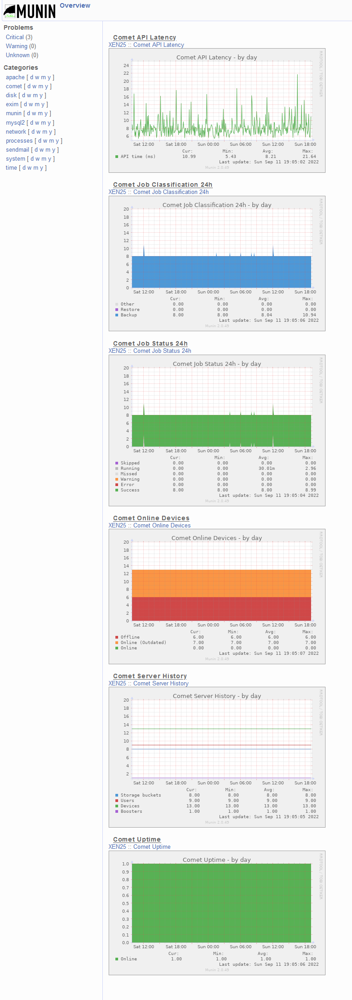

# Munin Plugin for Comet Server

[](https://twitter.com/CometBackup)

This is a set of scripts for [Munin](https://munin-monitoring.org/) to export metrics from a running Comet Server instance over the Comet Server API.

## Requirements

- Python 3.8.10 or later
- Munin 2.0.69 or later

[Recommended Munin Ubuntu install instructions](https://www.hackerxone.com/2021/10/14/steps-to-install-munin-monitoring-tool-on-ubuntu-20-04-lts/)

## Installation instructions

The following instructions will cover installing the comet-munin plugin on Ubuntu 20.04.

A lot of the instructions here need to be run as root, so run `sudo -i`  

1. Download, extract, and move the scripts to `/usr/share/munin/plugins`.  
Example:  

```bash
wget 'https://github.com/CometBackup/comet-munin-plugin/archive/refs/heads/main.zip'
unzip comet-munin-plugin-main.zip
cd comet-munin-plugin-main/comet-munin-plugin
mv comet_* /usr/share/munin/plugins
```

2. Set all the files aside from `comet_server.py` as executable and Create a symbolic link of these files to `/etc/munin/plugins`.  
```bash
for plugin in comet_jobs_classification comet_jobs_status comet_latency comet_online_devices comet_server_history comet_uptime; do
  chmod +x "/usr/share/munin/plugins/$plugin"
  ln -s "/usr/share/munin/plugins/$plugin" "/etc/munin/plugins/$plugin"
done
```

3. Enter your Comet Server admin credentials in `comet_server.py`  
`nano /usr/share/munin/plugins/comet_server.py`  
From here enter your credentials on line 9-11 in the quotation marks:  
`COMET_SERVER_URL = "https://mycometserver.com/"` - This must include http and the trailing forward slash.  
`COMET_ADMIN_USERNAME = "adminUsername"`  
`COMET_ADMIN_PASSWORD = "adminPassword"`  
Then save and close nano.

4. Once done, restart Munin and Munin node `systemctl restart munin munin-node`

## Generated graphs

|Graph                |Description
|----------------------|----
|Comet Online Devices|The total number of devices along with their version status
|Comet Server History|The current number of users, devices, storage buckets, and boosters
|Comet Job Status 24h|Jobs over the last 24 hours and their status
|Comet Job Classification 24h|Jobs over the last 24 hours and their classification
|Comet API Latency|Time taken to get the server configuration via an API call
|Comet Uptime|Whether the server is online or offline

## Running example

[](example.png)