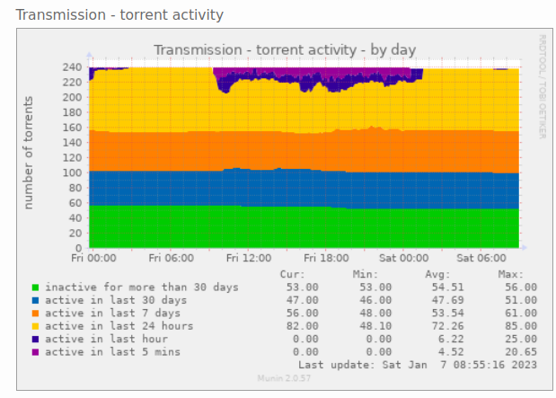
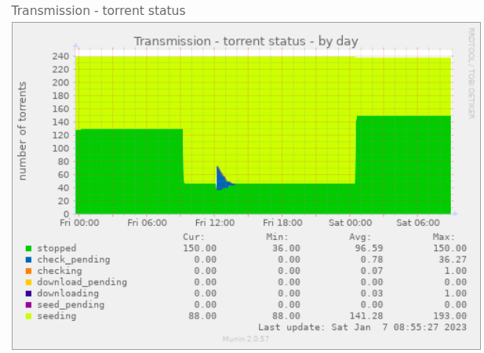
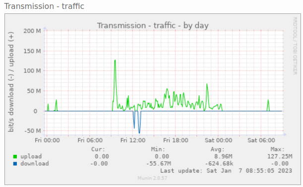

# Munin Transmission plugin

This plugin provides the following data/graphs:
 * activity: displaying the number of active/inactive torrents
 * status: displaying the number of torrents by their status (seeding, downloading, stopped, etc)
 * traffic: showing network traffic (download, upload) generated by transmission


## Installation, requirements

The plugin is written in python and uses the [transmission-rpc](https://pypi.org/project/transmission-rpc/). Install the package by `pip`:
```
sudo python3 -m pip install transmission-rpc
```

link the plugin to your /etc/munin/plugins/ directory:
```
cd /etc/munin/plugins/
ln -s /the/plugin/path/transmission_ transmission_activity
ln -s /the/plugin/path/transmission_ transmission_status
ln -s /the/plugin/path/transmission_ transmission_traffic
```

if your transmission doesn't run on the standard port or requires authentication, fill up the following variables (in `/etc/munin/plugin-conf.d/transmission`):
```
[transmission*]
    env.host localhost
    env.port 9091
    env.user transmission
    env.pass secret
```

## Example graphs

### Torrent activity


### Torrent status


### Transmission upload/download traffic


