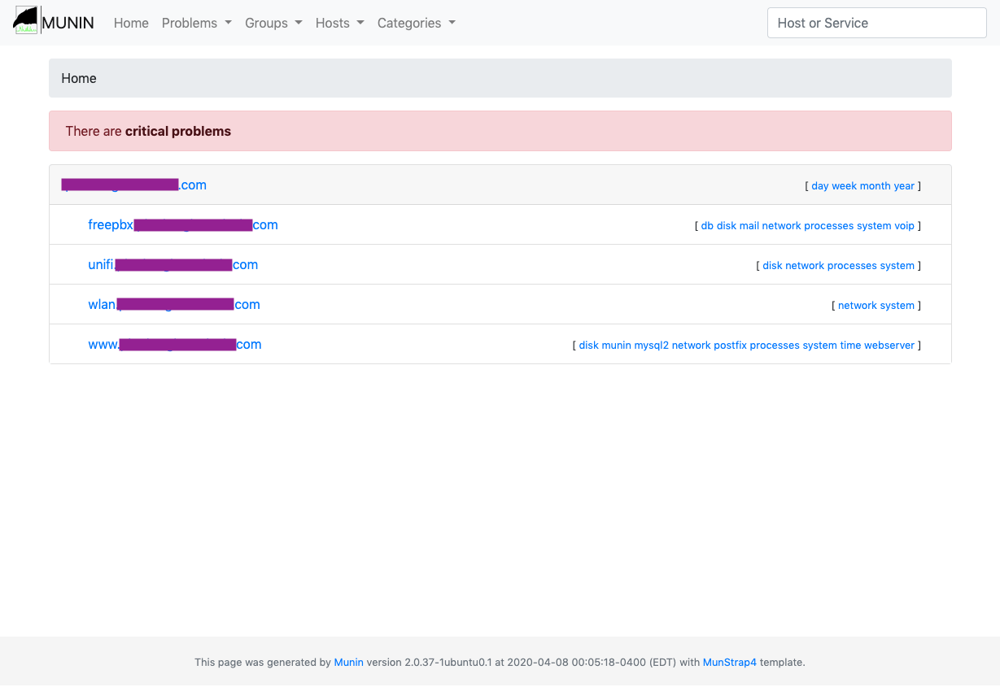
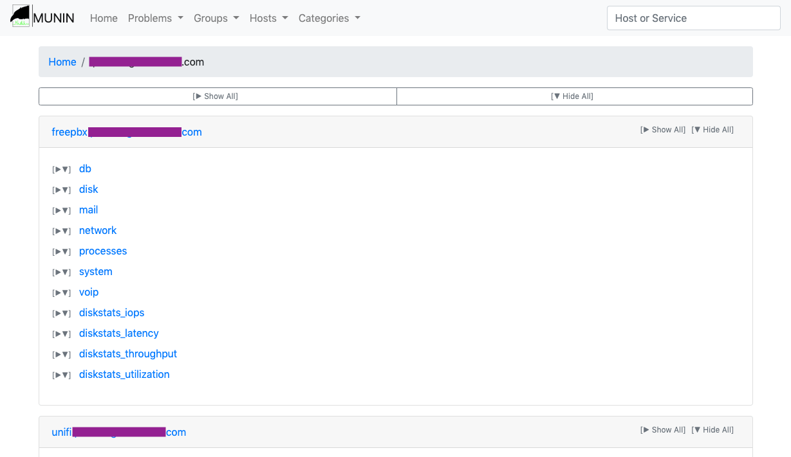
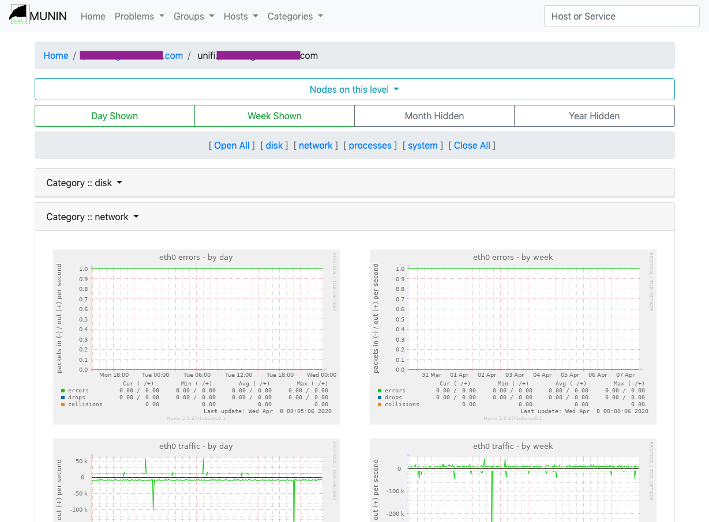

# MunCollapse

Alternative Munin 2.x templates based on Twitter Bootstrap using collapsibles.

Based on some of the work of "Munstrap" by [Jonny McCullagh](https://github.com/jonnymccullagh), [munin-monitoring/contrib](https://github.com/munin-monitoring/contrib/tree/master/templates/munstrap) repo.

#### Overview Sample Image
<a href="sample-image/sample-home.png"></a>

[Semi-Live Demo](https://jtsage.dev/munin-demo/) - For the purposes of this demo only, the data is static and the zoom functionality is disabled.

---

## Installation

### 1. Clone the munin-monitoring/contrib repo to a temporary location:

```
$ cd /opt
$ git clone https://github.com/munin-monitoring/contrib.git
```

### 2. Fetch the template libraries

```
$ cd /opt/contrib/templates/muncollapse/
$ make
```

### 3. Place the template in an appropriate safe place

Ubuntu shown - other distros may prefer ```/usr/local/share/munin/...```

```
$ mkdir /usr/share/munin/template
$ mkdir /usr/share/munin/template/muncollapse
```
__NOTE__: If this step fails, your munin installation may use ```/usr/local/share/munin/...``` instead!

```
$ cp -r /opt/contrib/templates/muncollapse/templates /usr/share/munin/template/muncollapse/
$ cp -r /opt/contrib/templates/muncollapse/static /usr/share/munin/template/muncollapse/
```

### 4. Edit your ```munin.conf``` file.

Typically located at ```/etc/munin.conf```

__FIND AND CHANGE:__ (near the top of the file)

```
# Where to look for the HTML templates
#
#tmpldir        /etc/munin/templates

# Where to look for the static www files
#
#staticdir /etc/munin/static
```

__TO:__
```
# Where to look for the HTML templates
#
tmpldir /usr/share/munin/template/muncollapse/templates

# Where to look for the static www files
#
staticdir /usr/share/munin/template/muncollapse/static
```

### 5. [Optional / Recommended] Clean out the old generated files.

This isn't really required, but there will likely be orphaned files.  The location of these files can be found in your ```munin.conf``` file, with the ```htmldir``` directive.

__NOTE:__ Ubuntu shown, other distributions may be in ```/var/www/munin/```

```
$ rm -rf /var/cache/munin/www/*
```

### 6. Wait Patiently

```munin-update``` will regenerate the files the next time it runs.  By default, this is on the :05 minute tick for most installations. If you do not have new files within 10 minutes, be sure to check ```munin-update.log``` and find out what went wrong.

---

## Revert to Official Munin Template

### 1. Edit your ```munin.conf``` file.

Typically located at ```/etc/munin.conf```

__FIND AND CHANGE:__ (near the top of the file - comment these lines out!)

# Where to look for the HTML templates
#
#tmpldir /usr/share/munin/template/muncollapse/templates

# Where to look for the static www files
#
#staticdir /usr/share/munin/template/muncollapse/static

### 2. [Optional / Recommended] Clean up

Remove the files from step #1 & #3 above, and repeat step #5 & #6.

---

## Samples

#### View of a group:
<a href="sample-image/sample-group.png"></a>

#### View of a specific node:
<a href="sample-image/sample-node.png"></a>


#### Zoom feature:
<a href="sample-image/sample-zoom.png"></a>


---

## Munin Compatibility

a/n: I am unsure of the compatibility with Munin 3. Most things will work from what I've read, but the navigation may be slightly funky.

---

### Browser Compatibility

For this template set, Internet Explorer support has been dropped for the dynamic zoom functions. Everything else should work across all browsers.
