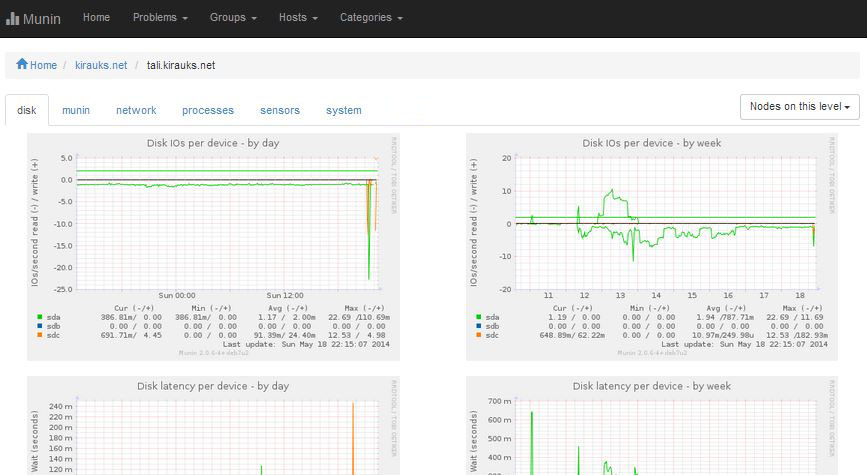
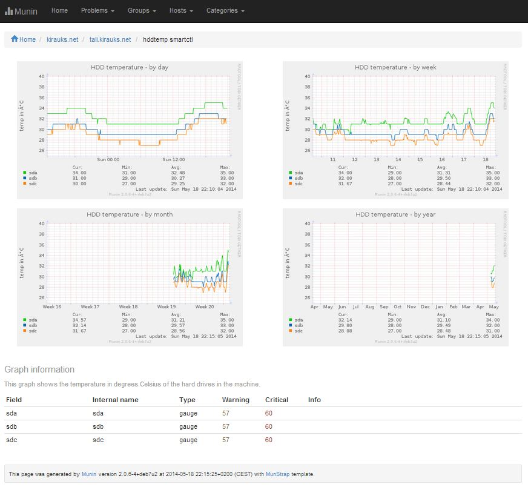
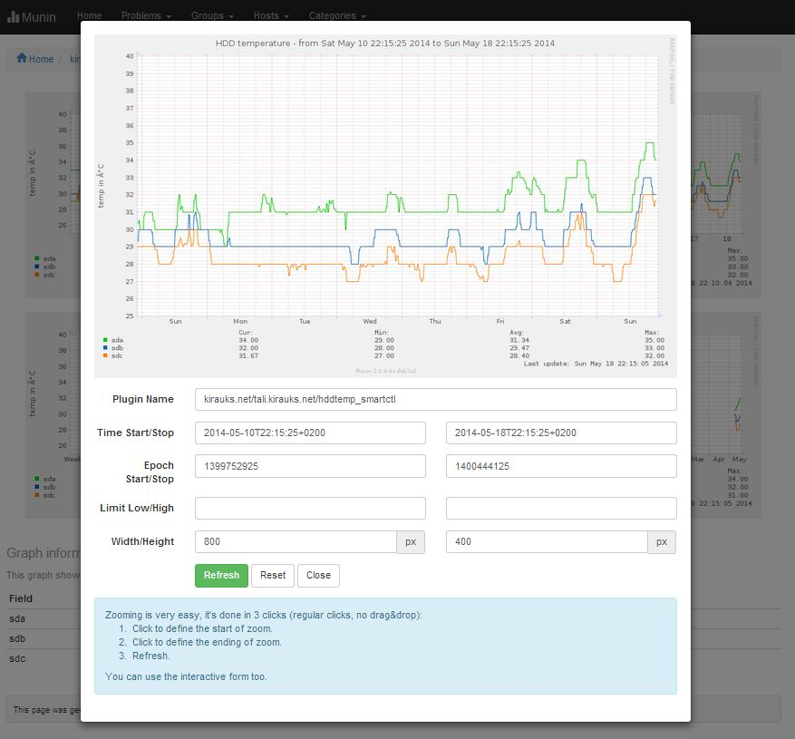

Munstrap
========

Alternative Munin 2.x templates based on Twitter Bootstrap 3.   
From February 2015 the Munstrap template has been added to the [munin-monitoring/contrib](https://github.com/munin-monitoring/contrib) repo.
Please use that location in future.



Installation
------------

Clone the munin-monitoring/contrib repo to a temporary location:

```
cd /opt
git clone https://github.com/munin-monitoring/contrib.git
```

Replace the Munin stock template with Munstrap (the -b options makes a backup of the official template for rolling back):

```
cd /etc/munin
cp -rb /opt/contrib/templates/munstrap/templates .
cp -rb /opt/contrib/templates/munstrap/static .
```

Clean the old generated files:

```
rm -rf /var/www/munin/*
```

Take a coffee and wait some minutes for the html generation by Munin.

Upgrades
--------

Get the last changes from Munstrap:

```
cd /opt/munstrap
git pull
```

Replace the old munstrap version with the new one:

```
cd /etc/munin
rm -rf templates static
cp -r /opt/contrib/templates/munstrap/templates .
cp -r /opt/contrib/templates/munstrap/static .
```

Revert to Official Munin Template
---------------------------------

```
cd /etc/munin
rm -rf templates static
mv templates~ templates
mv static~ static
```

Samples
-------

View of a specific node:


Zoom feature:

